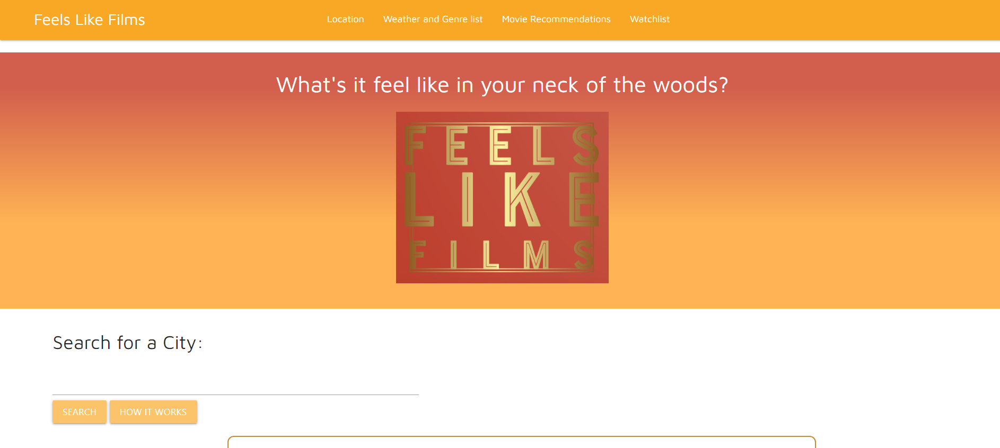

# Project 1 - Team 6: Team Dev-astate

## Table of Contents 
* [Website](#website)
* [Contributors](#contributors)
* [Technologies](#Technologies)

## Description 
Feels Like Films is a web applicaiton that allows users to get movie recommendations based on the current weather of a city. The genre of the recommendations correlates to the type of weather. Users can also choose to save the films they want onto a wish list.

  <!-- Placeholder Image-->

## Deployed Website
Here is a link to the deployed website:
[Feels Like Films](https://vtori37.github.io/Group-Project-1/)

## Technologies
* HTML5
* CSS 
* JS
* Materialize
* Moment.js

## Team Dev-estate Members
* [Dylan Truong](https://github.com/Dylan-Truong)
* [Jeff Whitehead](https://github.com/jwhitehead08)
* [Jonathan Kim](https://github.com/JonathanKim424)
* [Victoria Rice](https://github.com/vtori37)
 
***